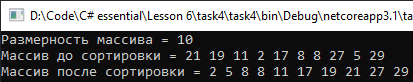

# Lesson6_task4
Условия задачки:
>Используя Visual Studio, создайте проект по шаблону Console Application.  
Требуется: Создать расширяющий метод для целочисленного массива, который сортирует элементы массива по возрастанию. 

Подытог: вот такенный майндфак на выходе
>
